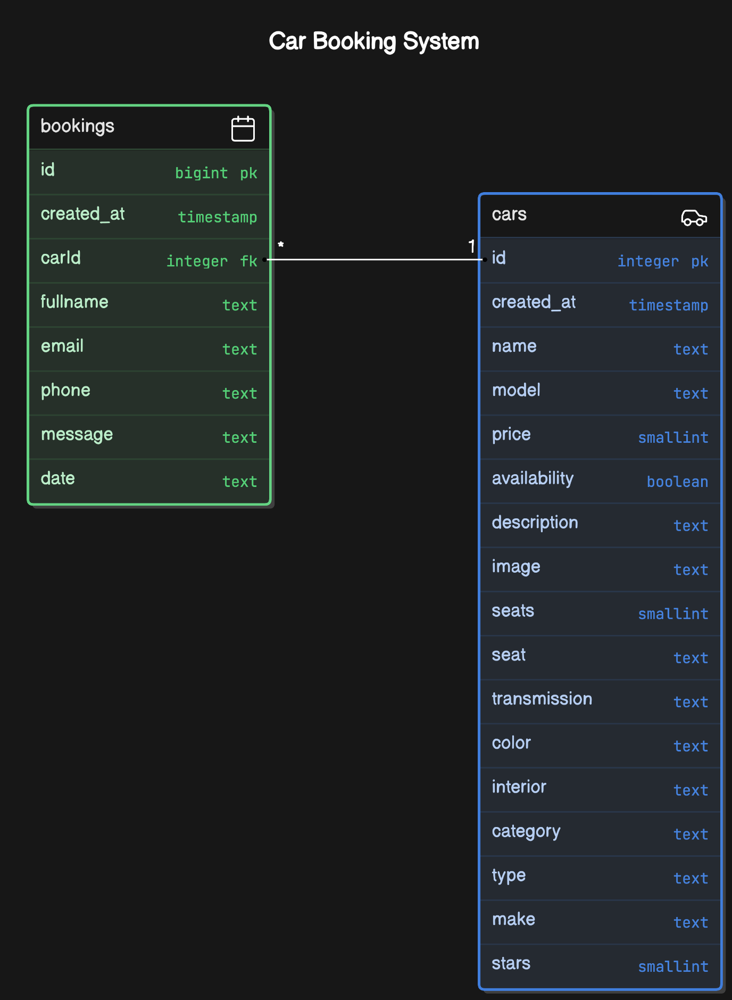

# limodrive-car-rental

## Routes

- `/` - Homepage
- `/vehicles` - Car preview listings
- `/vehicles/:id` - Individual car details and booking
- `/dashboard` - Protected route (user authentication required)

## Technologies Used

- TypeScript
- Supabase
- React Query
- Tailwind CSS
- React Icons
- Zod

## Database Schema



## Setup

1. Clone the repository
2. Install dependencies: `npm install`
3. Set up Supabase project and update environment variables

```dotenv
NEXT_PUBLIC_SUPABASE_URL=supabase-url
NEXT_PUBLIC_SUPABASE_ANON_KEY=public-anon-key
```

4. Run the development server: `npm run dev`
